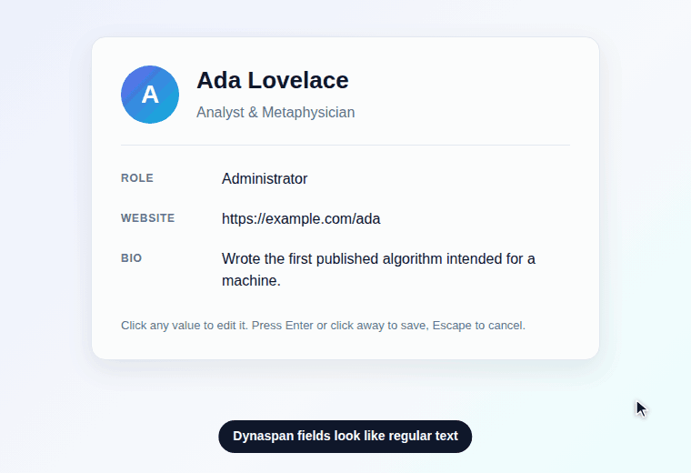
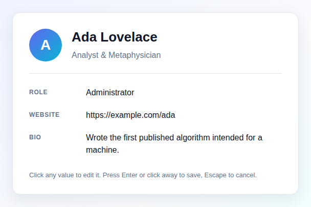
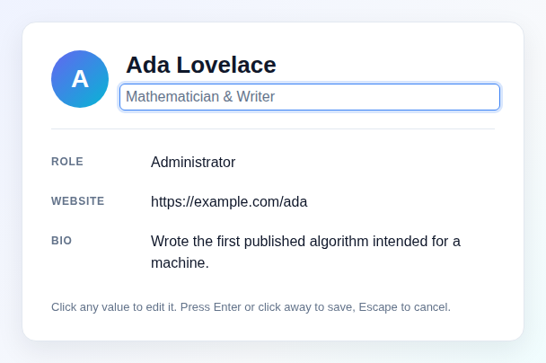

# Dynaspan

[](https://rubygems.org/gems/dynaspan)
[](https://github.com/danielpclark/dynaspan/actions/workflows/ci.yml)

**Click-to-edit, in-place AJAX editing for Rails.**

Dynaspan shows a record's attribute as ordinary text on your page. Click the
text and it turns into a text field, text area or select. Click away (or press
<kbd>Enter</kbd>) and the change is sent to your controller's `update` action
over AJAX, and the field turns back into plain text.

```erb
<%= dynaspan_text_field(@user, :name) %>
```



| Before: plain text on the page | After a click: an input, ready to type |
| --- | --- |
|  |  |

- Text fields, text areas and selects
- Nested attributes (`accepts_nested_attributes_for`), one level deep
- No jQuery, rails-ujs or Turbo required, but it works alongside all three
- Works with importmap-rails, Propshaft and Sprockets
- Keyboard accessible: <kbd>Tab</kbd> to the text, <kbd>Enter</kbd> to edit,
  <kbd>Enter</kbd> to save, <kbd>Esc</kbd> to cancel
- DOM events and CSS state classes for styling and custom behaviour

## Requirements

- Ruby 3.1+
- Rails 7.1, 7.2, 8.0 or 8.1

## Installation

Add the gem to your Gemfile and run `bundle install`:

```ruby
gem 'dynaspan'
```

Then load the JavaScript using whichever asset setup your app uses.

**importmap-rails** (the Rails 7+ default). The pin is added for you, so just
import it in `app/javascript/application.js`:

```js
import "dynaspan"
```

**Sprockets.** Add this to `app/assets/javascripts/application.js`:

```js
//= require dynaspan/dynaspan
```

**Propshaft, jsbundling-rails or anything else.** Add a script tag to your
layout:

```erb
<%= javascript_include_tag "dynaspan/dynaspan", defer: true %>
```

Optionally, add the default styles (hover highlight, full-width inputs, saving
and error states):

```erb
<%= stylesheet_link_tag "dynaspan/dynaspan" %>
```

The view helpers are available in every view automatically.

## Usage

```erb
<%= dynaspan_text_field(@user, :name) %>
<%= dynaspan_text_area(@user, :bio) %>
<%= dynaspan_select(@user, :role, choices: [["Administrator", "admin"], ["Editor", "editor"]]) %>
```

Each helper renders the current value as text, together with a hidden form for
the record. When the value changes, the form is submitted to the record's
`update` route (`PATCH /users/:id`), just as a normal `form_with(model: @user)`
form would be. Your controller only needs to permit the attribute:

```ruby
class UsersController < ApplicationController
  def update
    @user = User.find(params[:id])

    respond_to do |format|
      if @user.update(user_params)
        format.html { redirect_to @user }
        format.json { render json: @user }
      else
        format.html { render :edit, status: :unprocessable_entity }
        format.json { render json: @user.errors, status: :unprocessable_entity }
      end
    end
  end

  private

  def user_params
    params.require(:user).permit(:name, :bio, :role)
  end
end
```

The request asks for Turbo Stream, JavaScript, JSON or HTML, in that order, so
a standard scaffold controller works as it is. Turbo Stream
(`update.turbo_stream.erb`) and JavaScript (`update.js.erb`) responses are
applied to the page. A response with an error status (such as a failed
validation) adds the `ds-error` class to the field and fires `dynaspan:error`.

### Edit text

Blank values have nothing to click on. Pass some edit text as the argument
after the attribute to give people something to click:

```erb
<%= dynaspan_text_field(@user, :nickname, "[edit]") %>
```

### Nested records

Pass the nested record before the attribute to edit it through its parent. The
parent must have `accepts_nested_attributes_for` for the association:

```ruby
class Article < ApplicationRecord
  has_many :comments
  accepts_nested_attributes_for :comments
end
```

```erb
<%= dynaspan_text_field(@article, comment, :note, "[edit]") %>
```

This submits `article[comments_attributes][0][id]` and
`article[comments_attributes][0][note]` to `ArticlesController#update`.
Remember to permit `comments_attributes: [:id, :note]`.

### Arguments

```ruby
dynaspan_text_field(record, nested_record = nil, :attribute, edit_text = nil, options = {})
dynaspan_text_area(record, nested_record = nil, :attribute, edit_text = nil, options = {})
dynaspan_select(record, nested_record = nil, :attribute, edit_text = nil, options = {}, &block)
```

1. **record**: the model instance whose `update` action is called.
2. **nested_record** (optional): a record from one of `record`'s nested
   attribute associations.
3. **:attribute**: a Symbol naming the attribute to edit.
4. **edit_text** (optional): a String shown next to the value that can also be
   clicked to start editing.
5. **options** (optional): a Hash, see below.

### Options

| Option | Description |
| --- | --- |
| `:choices` | `dynaspan_select` only. The choices for the select: an array, a hash, grouped choices or `options_for_select` output. |
| `:options` | `dynaspan_select` only. Options for Rails' `select`, such as `include_blank:` or `prompt:`. |
| `&block` | `dynaspan_select` only. Passed through to Rails' `select`. |
| `:html_options` | HTML attributes for the input, e.g. `{ class: "wide", rows: 4, placeholder: "Name" }`. Classes are added to Dynaspan's own. `:id`, `:onblur` and `:onfocus` are reserved. |
| `:hidden_fields` | A Hash of extra values to submit, rendered as hidden fields: `{ page_name: "profile" }`. |
| `:form_for` | Options for the underlying `form_for`, e.g. `{ url: admin_user_path(@user) }` for namespaced routes. |
| `:unique_id` | Sets the id suffix used for the elements. By default an id is built from the record, the attribute and some random characters. |
| `:callback_on_update` | A string of JavaScript run each time a change is sent, e.g. `"refreshTotals();"`. |
| `:callback_with_values` | A JavaScript function call as a string, e.g. `"saved();"`. A Hash is appended as its last argument: `{ ds_selector: "#dyna_span_block…", ds_input: "entered text" }`. |

For new code, prefer the [JavaScript events](#javascript-events) over the two
callback options. The callbacks are evaluated as strings, so they need
`unsafe-eval` if you use a Content Security Policy.

## Keyboard

| Key | Where | Action |
| --- | --- | --- |
| <kbd>Tab</kbd> | Page | Move focus to a Dynaspan value |
| <kbd>Enter</kbd> / <kbd>Space</kbd> | Value | Start editing |
| <kbd>Enter</kbd> | Text field | Save |
| <kbd>Ctrl</kbd>/<kbd>⌘</kbd> + <kbd>Enter</kbd> | Text area | Save |
| <kbd>Esc</kbd> | Field | Cancel and restore the previous value |

Clicking anywhere outside the field also saves it. Nothing is sent to the
server when the value did not change.

## JavaScript events

Events are dispatched on the Dynaspan block (`div.dyna-span`) and bubble up
to `document`:

| Event | When | `event.detail` |
| --- | --- | --- |
| `dynaspan:open` | The field is shown | `selector`, `value` |
| `dynaspan:close` | The field is hidden | `selector`, `value`, `changed` |
| `dynaspan:update` | A change is about to be sent. Call `preventDefault()` to skip the request. | `selector`, `input` (display text), `value`, `form` |
| `dynaspan:success` | The server responded successfully | same as `update`, plus `response` |
| `dynaspan:error` | The request failed or returned an error status | same as `update`, plus `error` and `response` |

```js
document.addEventListener("dynaspan:success", (event) => {
  console.log("Saved", event.detail.value)
})
```

You can also control a field from JavaScript by its id (set it with the
`:unique_id` option):

```js
Dynaspan.show("user-name")    // open the field
Dynaspan.hide("user-name")    // close it and save if changed
Dynaspan.cancel("user-name")  // close it and discard the change
```

If jQuery is on the page, the 0.x API (`$().dynaspan.upShow(id)`,
`upHide(id)` and `upLast(id)`) still works.

## Styling

The markup looks like this:

```html
<div id="dyna_span_block{id}" class="dyna-span ds-content-present" data-dynaspan="{id}">
  <div id="dyna_span_div{id}" class="dyna-span-form"><form>…the input…</form></div>
  <span id="dyna_span_span{id}" class="dyna-span dyna-span-text">The value</span>
  <div class="dyna-span-edit-text pull-right">[edit]</div>
</div>
```

These classes are toggled on the outer `div.dyna-span`:

| Class | Present when |
| --- | --- |
| `ds-content-present` | The value isn't blank |
| `ds-dialog-open` | The input is showing |
| `ds-saving` | A request is in flight |
| `ds-error` | The last request failed |

The input always has the classes `dyna-span-input` and `form-control` (so it
fits in with Bootstrap), plus any you add with `html_options`. For example, to
keep the edit text beside a value instead of below it:

```css
.ds-content-present > .dyna-span-edit-text { margin-top: -18px; }
.ds-dialog-open > .dyna-span-edit-text { margin-top: -24px; }
```

To change the markup itself, copy
[`app/views/dynaspan/_dynaspan.html.erb`](app/views/dynaspan/_dynaspan.html.erb)
into your application at the same path.

## Upgrading from 0.x

- Rails 7.1+ and Ruby 3.1+ are required.
- jQuery and rails-ujs are no longer needed. Load `dynaspan/dynaspan` as shown in
  [Installation](#installation). If you had `//= require dynaspan/dynaspan`
  already, it keeps working.
- `include Dynaspan::ApplicationHelper` is no longer necessary.
- A request is sent only when the value changed, so `callback_on_update` and
  `callback_with_values` only run for real changes.
- If you overrode `_dynaspan_text_field`, `_dynaspan_text_area` or
  `_dynaspan_text_select`, move your changes to `_dynaspan.html.erb`.
- Passing a nested record whose association lacks
  `accepts_nested_attributes_for` now raises an `ArgumentError`.

See the [CHANGELOG](CHANGELOG.md) for everything else.

## Development

```sh
bundle install
bundle exec rake test                  # helper and browser tests (needs Chrome/Chromium)
RAILS_VERSION=7.2 bundle update        # test against another Rails version
bin/demo                               # the demo app at http://localhost:3000
```

The browser tests use [Cuprite](https://github.com/rubycdp/cuprite). Set
`BROWSER_PATH` if Chrome isn't found automatically.

The demo GIF and screenshots above are recorded from `bin/demo` with
[Playwright](https://playwright.dev) and assembled with
[Pillow](https://python-pillow.org):

```sh
PORT=3999 bin/demo &
node script/demo/record.js        # captures frames and the screenshots
python3 script/demo/build_gif.py  # writes docs/images/dynaspan-demo.gif
```

## License

The MIT License (MIT). Copyright (C) 2014-2026 by Daniel P. Clark. See
[LICENSE](LICENSE).
